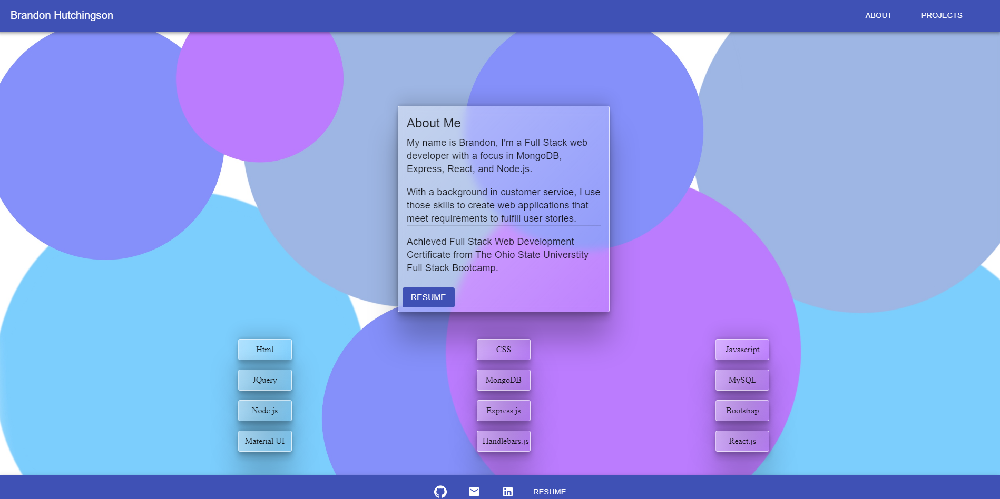

# REACT-Portfolio

## Table of Contents

  - [Description](#description)
  - [Technologies](#technologies)
  - [Table of Contents](#table-of-contents)
  - [Screenshot](#screenshot)
  - [Deployment](#deployment)
  - [Contributing](#contributing)

## Description

A personal portfolio created using React.js. This project demonstrates react features including Props, Hooks, State, Router, and more.

## Technologies

- React.js
- Material UI
- npm packages
  - create-react-app
  - AOS

## Screenshot

## Deployment

[Deployed App](https://bhutchingson.github.io/react-portfolio/#/About)

## Contributing

GitHub: https://github.com/bHutchingson
